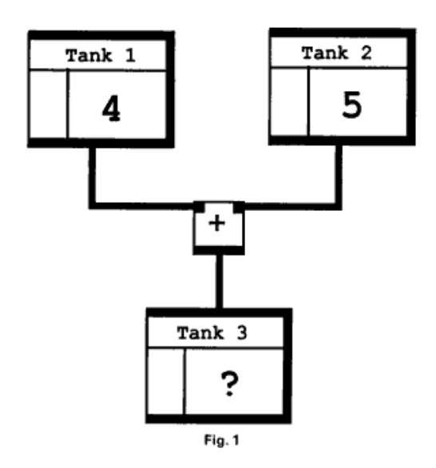

# Colophon

## About Liberator

Liberator is a visual programming environment for Haskell, designed to support the teaching of
functional programming at A-Level Computer Science. It grew out of a conviction that students
find functional thinking easier to grasp when they can see the data flow directly — when a
function is a node, an argument is a wire, and evaluation is just following the graph to its
leaves.

---

## Authorship

**Liberator was conceived, designed, and directed by [Miles Berry](https://milesberry.net)**,
Professor of Computing Education at the University of Roehampton.

Miles defined the educational purpose of the tool, shaped every aspect of its design, and
brought deep expertise in both Haskell and the A-Level CS curriculum to every decision about
what to include and how to present it. He wrote the getting-started guide, gathered and
curated the screenshot walkthrough, specified the built-in examples, and tested the tool
relentlessly throughout development, filing a steady stream of precise bug reports and
improvement suggestions that drove the work forward.

---

## How it was built

The implementation of Liberator was written collaboratively with
**[Claude](https://claude.ai)**, Anthropic's AI assistant, using
[Claude Code](https://claude.ai/claude-code) — a terminal-based agentic coding tool.

The development process was a genuine back-and-forth. Miles would describe a feature or report
a bug; Claude would propose an implementation, write the code, run the TypeScript compiler, and
explain the trade-offs. Miles would test it in the browser, give precise feedback ("the value
nodes are still wider than the operator nodes"), and the cycle would repeat. At no point was
code generated and accepted wholesale — every piece was reviewed, questioned, and often revised.

A rough accounting of the responsibilities:

| | Miles Berry | Claude |
|---|---|---|
| **Concept & purpose** | ✓ | |
| **Educational design** | ✓ | |
| **Feature specification** | ✓ | |
| **UI / UX decisions** | ✓ | |
| **Testing & bug reports** | ✓ | |
| **React / TypeScript implementation** | | ✓ |
| **Haskell evaluator & type checker** | | ✓ |
| **Graph layout algorithm** | | ✓ |
| **Store architecture (Zustand/Immer)** | | ✓ |
| **Bug diagnosis & fixes** | shared | shared |
| **Documentation & screenshots** | shared | shared |

Architecturally significant decisions made during development include:

- **Expression-tree evaluator** — the canvas is never evaluated directly; it is first compiled
  to a recursive `ExprTree` type and then reduced by a small call-by-value interpreter. This
  keeps evaluation clean and makes the Haskell code generator straightforward.

- **CSS custom-property theming** — rather than duplicating Tailwind classes for dark and light
  modes, all colours are expressed as `var(--bg-*)` / `var(--text-*)` properties toggled by a
  `data-theme` attribute on `<html>`. This keeps the component tree free of conditional style
  logic.

- **Subgraph architecture** — function nodes (modules) each own a nested subgraph stored
  alongside the root graph in Zustand. Navigation between graphs uses a breadcrumb stack;
  evaluation builds a `letrec` expression that correctly handles mutual and self-recursion.

- **Type inference as a side-channel** — rather than colouring edges by mutating the graph,
  the type checker runs as a Zustand subscription and writes results into a separate `typeStore`.
  This avoids infinite update loops and keeps the graph store append-only during a run.

---

## Technology

| Layer | Library / version |
|---|---|
| UI | React 19 |
| Canvas | [@xyflow/react](https://reactflow.dev) 12 |
| State | [Zustand](https://zustand-demo.pmnd.rs) 5 + [Immer](https://immerjs.github.io/immer/) 11 |
| Styling | [Tailwind CSS](https://tailwindcss.com) 4 |
| Icons | [Lucide React](https://lucide.dev) |
| Build | [Vite](https://vitejs.dev) 7 + TypeScript 5 |

---

## Inspiration

Liberator sits in a longer tradition of visual functional programming environments for education.

**[Logotron Numerator](https://www.jstor.org/stable/30215030)** (1989) for the Acorn Archimedes
was an early visual environment for functional programming in schools, developed by Logotron.
Students could build functional programs by connecting boxes on screen — a direct ancestor of the
idea behind Liberator.

**[Visual Haskell](https://ptolemy.berkeley.edu/~johnr/papers/visual.html)** (Reekie, 1994) was the first attempt to give Haskell itself a graphical syntax,
representing functions as enclosing boxes and data flow as directed arrows — naming a research
direction that has continued ever since.

**[Viskell](https://github.com/viskell/viskell)** (University of Twente, 2015) is a visual Haskell
environment with a multi-touch interface and live type feedback on connections, demonstrating that
node-and-wire interfaces for functional languages remain a compelling research direction.

**[Snap!](https://snap.berkeley.edu/)** (Harvey and Mönig) is a block-based language that takes
functional programming seriously: procedures are first-class values, higher-order functions such
as `map` and `combine` are built in, and custom blocks support full recursion — including
recursive calls within their own definitions. Snap! demonstrates that blocks and genuine
functional thinking are not in tension, and that recursion need not be hidden from learners.

**[A Block Design for Introductory Functional Programming in Haskell](https://doi.org/10.1109/BB48857.2019.8941214)** (Poole, 2019) explored using
colour and block shape to make Haskell's type system visible to learners — the wire colouring in
Liberator is in the same spirit.

Work in this area continues: **[the MNL](https://dl.acm.org/doi/10.1145/3759534.3762684)**
(Lolong, 2025) introduces reactive blocks with real-time type feedback for novice programmers.

---

## Acknowledgements

The built-in examples draw on classic functional programming exercises, including several
problems from [Project Euler](https://projecteuler.net) and sorting algorithms from standard
introductory Haskell texts.

The [AQA A-Level Computer Science specification](https://www.aqa.org.uk/subjects/computer-science/a-level/computer-science-7517/specification) provided the curriculum framework that shaped
which features to build first and which to leave for later.

---

*Liberator — visual Haskell. Built with care.*
