# Getting Started with Liberator

**Liberator** is a visual programming environment for functional programming using Haskell.
Instead of typing code, you build programs by connecting nodes on a canvas — but every graph
you create corresponds directly to real Haskell, which you can view and export at any time.

This guide follows the same progression as a typical introductory Haskell worksheet:
simple functions, list operations, higher-order functions, and finally a sorting algorithm.
By the end you will be able to build all of these visually and understand how they map to
written Haskell.

---

## The canvas

When you open Liberator you see an empty canvas with a toolbar across the top and a palette
of node types on the left.

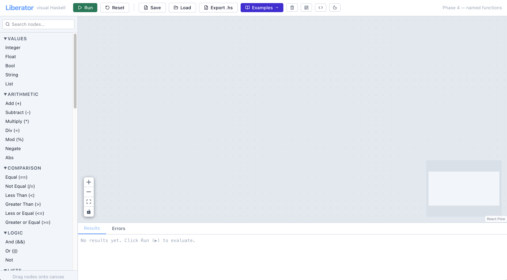

| Area | What it does |
|------|-------------|
| **Toolbar** | Run, Save, Load, Export, Examples, layout tools |
| **Left palette** | All the node types you can drag onto the canvas |
| **Canvas** | Where you connect nodes to build programs |
| **Output panel** | Shows results after you click Run |
| **Haskell panel** | Shows the Haskell source for your current graph (toggle with the `</>` button) |

### Adding nodes

Drag any node type from the left palette onto the canvas. You can also press **Ctrl+K** to
open a quick-search menu. The **Examples** menu in the toolbar lets you load a complete
worked example at any time.

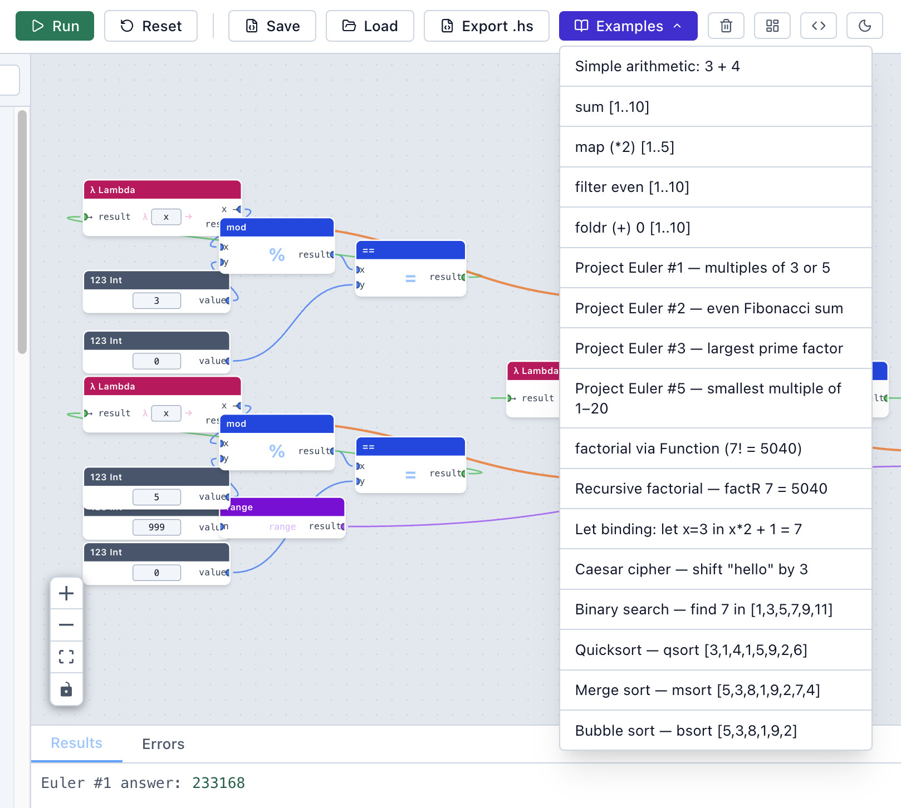

### Connecting nodes

Every node has **ports** — small circles on its left (inputs) and right (outputs).
Click and drag from an output port to an input port to create a connection (an edge).
The edge carries a value from one node to the next.

### Running your program

Click **Run** in the toolbar to evaluate all Output nodes on the canvas.
Results appear in the Output panel at the bottom. Click **Reset** to clear the results.

---

## 1. Your first calculation — `halve 12`

In Haskell: `halve x = x / 2`

Let's build this step by step.

**Step 1.** Drag a **Value** node onto the canvas. Set its type to `Float` and its value to `12`.

**Step 2.** Drag a **PrimOp** node and choose the `/` operator.

**Step 3.** Drag another **Value** node, type `Float`, value `2`.

**Step 4.** Drag an **Output** node. Give it the label `halve 12`.

**Step 5.** Connect:
- Value `12` → `/` (left input)
- Value `2` → `/` (right input)
- `/` result → Output

**Step 6.** Click **Run**. The Output panel shows `6.0`.

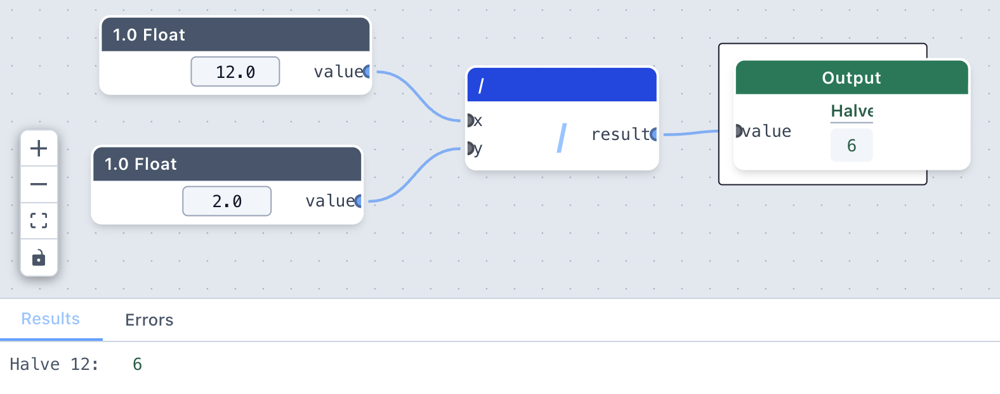

Click the **`</>`** button in the toolbar to open the Haskell panel. You'll see:

```haskell
main :: IO ()
main = print (12.0 / 2.0)
```

> **Connection to Haskell:** `halve x = x / 2` defines a function. Here we have hard-coded
> the input — in the next section we'll use a **Lambda** node to make a proper reusable function.

---

## 2. Functions — `double` and `square`

In Haskell:
```haskell
double x = x * 2
square x = x * x
```

A **Lambda** node lets you define a function that takes a parameter.
It has three ports:
- **param** (output) — the function's input variable, wired to wherever you use it
- **body** (input) — the expression that gets computed
- **λ** (output) — the resulting function, which you can pass to `map`, `filter`, etc.

### Building `double`

**Step 1.** Drag a **Lambda** node. Set the parameter name to `x`.

**Step 2.** Drag a **Value** node, type `Int`, value `2`.

**Step 3.** Drag a **PrimOp** `*` node.

**Step 4.** Connect:
- Lambda **param** → `*` left input  *(x goes into the multiplication)*
- Value `2` → `*` right input
- `*` result → Lambda **body**

The Lambda node now represents the function `\x -> x * 2`.

**Step 5.** To test it: drag a **Value** node (`Int`, value `5`), an **Apply ($)** node,
and an **Output** node. Connect:
- Lambda **λ** → Apply **fn**
- Value `5` → Apply **arg**
- Apply result → Output

**Step 6.** Click **Run** — Output shows `10`.

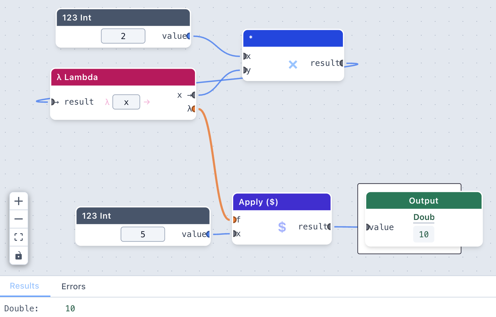

> **Try it:** change the Value node to `7` and click Run again — you get `14`.
> The Lambda node defines the function; the Value and Apply nodes *call* it.

### Building `square`

The only difference from `double`: use `x * x` instead of `x * 2`.
Wire the Lambda **param** port to **both** inputs of the `*` node
(you can fan out from one output port to multiple inputs).

---

## 3. Boolean functions — `isEven`

In Haskell: `isEven x = x \`mod\` 2 == 0`

**Step 1.** Lambda node, parameter `x`.

**Step 2.** PrimOp `mod` node — connects x and 2.

**Step 3.** Value node, `Int`, `2`.

**Step 4.** PrimOp `==` node — compares mod result to 0.

**Step 5.** Value node, `Int`, `0`.

**Step 6.** Connect:
- Lambda param → `mod` left input
- `2` → `mod` right input
- `mod` result → `==` left input
- `0` → `==` right input
- `==` result → Lambda body

**Step 7.** Test with Apply + Output as before. `isEven 4` → `True`, `isEven 7` → `False`.

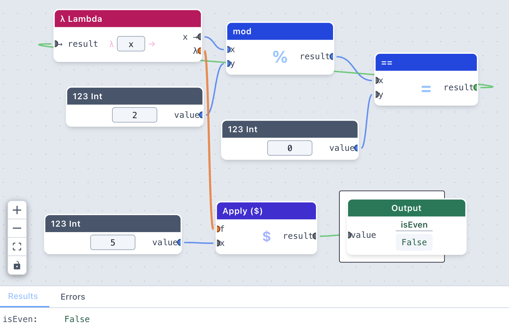

> **Try it yourself:** build `isOdd` — you could either use `mod 2 == 1`, or use the `not`
> PrimOp to negate `isEven`.

---

## 4. List operations — `head` and `tail`

In Haskell:
```haskell
head' (x:xs) = x
tail' (x:xs) = xs
```

Liberator has `head` and `tail` as built-in **ListOp** nodes — no need to define them yourself.

**Step 1.** Drag a **Value** node, type `List`, value `[3,1,4,1,5,9]`.

**Step 2.** Drag a **ListOp** `head` node and an **Output** labelled `head`.

**Step 3.** Drag a **ListOp** `tail` node and another **Output** labelled `tail`.

**Step 4.** Connect the list to both `head` and `tail`, then each to its output.

**Step 5.** Run — `head` gives `3`, `tail` gives `[1,4,1,5,9]`.

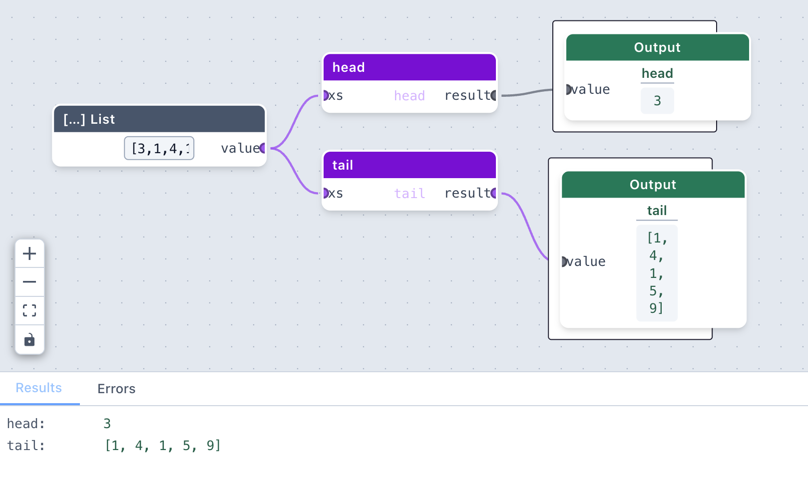

**Shortcut — `x:xs` node:** The Lists palette also has an **x:xs (uncons)** node that does both at once. It takes one list input and has two output ports — `head` and `tail` — so you can fan out to both in a single node. This is especially useful inside recursive functions where you need both parts.

Other useful ListOp nodes: `length`, `reverse`, `sum`, `product`, `maximum`, `minimum`,
`take`, `drop`, `cons` (add an element to the front of a list), `++` (concatenate two lists), `null` (test whether a list is empty).

---

## 5. The `range` node — `[1..n]`

Haskell's `[1..n]` notation is available as a **ListOp** `range` node.

**Step 1.** Drag a **Value** `Int` `10` and a **ListOp** `range` node.

**Step 2.** Connect and add an Output. Run — you get `[1,2,3,4,5,6,7,8,9,10]`.

Chain it with `sum` to reproduce `sum [1..10]`. This is Example 2 in the Examples menu — load it to see the full graph.

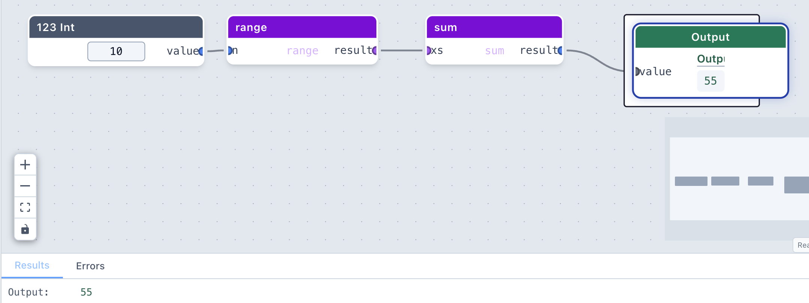

---

## 6. Higher-order functions

This is where Liberator really shines. Higher-order functions take *other functions* as
arguments — exactly what Lambda nodes are for.

### `map` — applying a function to every element

In Haskell: `map double [1..5]` gives `[2,4,6,8,10]`

**Step 1.** Build the `double` lambda as in section 2 (param `x`, body `x * 2`).

**Step 2.** Drag a **Value** `List` `[1,2,3,4,5]` and a **HOF** `map` node.

**Step 3.** Connect:
- Lambda **λ** → map **f**
- List → map **xs**
- map result → Output

**Step 4.** Run — Output shows `[2,4,6,8,10]`.

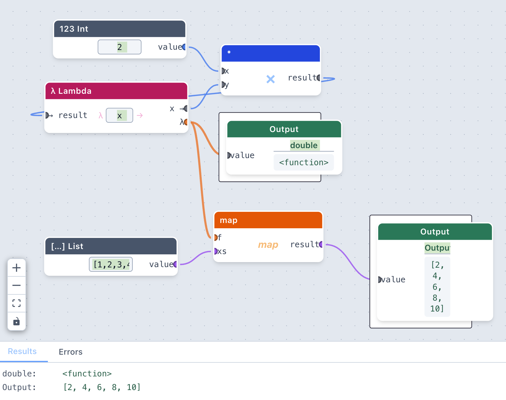

> The `map` node in Liberator corresponds directly to Haskell's `map :: (a → b) → [a] → [b]`.
> The Lambda node *is* the `(a → b)` part.

### `filter` — keeping elements that pass a test

In Haskell: `filter isEven [1..10]` gives `[2,4,6,8,10]`

**Step 1.** Build the `isEven` lambda (param `x`, body `x mod 2 == 0`).

**Step 2.** Drag a **Value** `List` `[1,2,3,4,5,6,7,8,9,10]` and a **HOF** `filter` node.

**Step 3.** Connect lambda **λ** → filter **p**, list → filter **xs**, result → Output.

**Step 4.** Run — `[2,4,6,8,10]`.

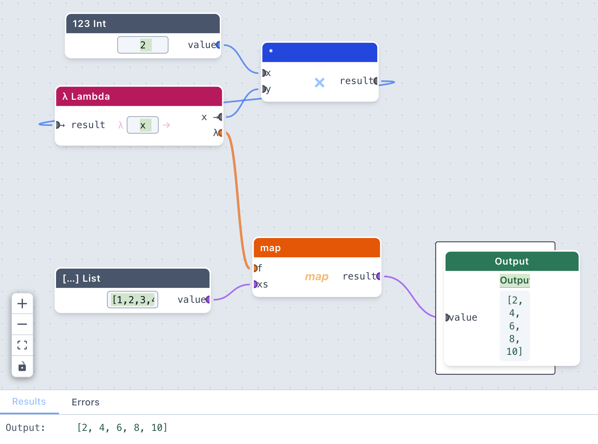

This is Example 4 in the Examples menu.

### `foldr` — reducing a list to a single value

In Haskell: `foldr (+) 0 [1..10]` sums the list.

`foldr` takes three inputs:
- **f** — a two-argument function (the combining function)
- **z** — the starting/identity value
- **xs** — the list

For summing, the combining function is `(+)`. In Liberator you can use a bare PrimOp node
as a function — just connect it to the **f** port without filling its inputs.

**Step 1.** Drag a PrimOp `+` node. **Don't** connect its inputs — leave them empty.
  This makes it a *section*, equivalent to Haskell's `(+)`.

**Step 2.** Drag a **Value** `Int` `0` (the identity for addition).

**Step 3.** Drag a **ListOp** `range` with a **Value** `10` input.

**Step 4.** Drag a **HOF** `foldr` node. Connect:
- `+` → foldr **f**
- `0` → foldr **z**
- range result → foldr **xs**

**Step 5.** Run — `55`.

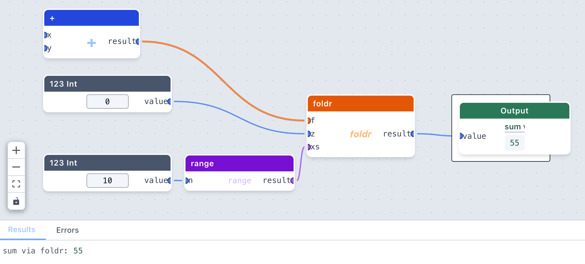

This is Example 5 in the Examples menu.

---

## 7. Putting it together — `map` and `filter` combined

The worksheet asks: *use `filter` and `map` to find even numbers in the squares of [1..10].*

In Haskell: `filter isEven (map square [1..10])` gives `[4,16,36,64,100]`

**Step 1.** Build a `square` lambda (param `x`, body `x * x`).

**Step 2.** Build an `isEven` lambda (param `x`, body `x mod 2 == 0`).

**Step 3.** Drag a **ListOp** `range`, Value `10`, **HOF** `map`, **HOF** `filter`, Output.

**Step 4.** Connect:
- `10` → range
- square λ → map **f**, range result → map **xs**
- isEven λ → filter **p**, map result → filter **xs**
- filter result → Output

**Step 5.** Run — `[4,16,36,64,100]`.

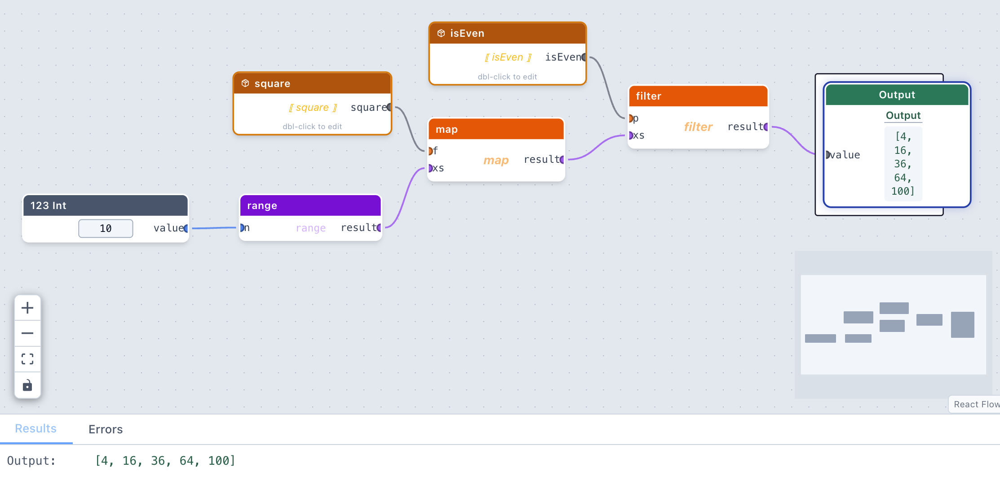

> Notice how the output of `map` flows directly into the input of `filter` — this is
> **function composition** expressed visually. In Haskell you'd write it with `$` or `.`.

---

## 8. Recursive functions — `sum'` (using `if`)

```haskell
sum' [] = 0
sum' xs = head xs + sum' (tail xs)
```

Recursive functions are built by **wrapping** nodes into a named module, exactly as in
section 8b. Because this version uses three separate nodes (`null`, `head`, `tail`) that all
need the same `xs` input, wrapping creates extra anchor nodes that need tidying — the same
two-pass approach applies.

### Pass 1 — build, wire, and wrap

**Step 1.** Drag seven nodes:

| Node | Setting |
|------|---------|
| **ListOp null** | — |
| **ListOp head** | — |
| **ListOp tail** | — |
| **Value** | Int, `0` |
| **If** | — |
| **PrimOp +** | — |
| **Call Function** | type `sum'` in the name field |
| **Output** | label: `sum` |

**Step 2.** Wire all connections that don't require `xs`:
- null result → If **cond**
- Value `0` → If **then**
- head result → `+` **x**
- tail result → Call **xs**
- `+` result → If **else**
- If result → Output

Leave null, head, and tail **xs** inputs unconnected.

**Step 3.** Select all seven nodes and click **Wrap as function**, name it `sum'`.

The module appears with **four anchor nodes** inside: three labelled `xs` (one each for
null, head, and tail) and one labelled `y` (for the unconnected `+` input).

### Pass 2 — clean up anchors and complete

**Step 4.** Double-click the module to enter its subgraph.

Delete two of the three `xs` anchors and the `y` anchor — keep just one `xs` anchor.
That anchor is already wired to whichever of null/head/tail it was created for; now also
wire it to the other two:
- `xs` anchor → null **xs**
- `xs` anchor → head **xs**
- `xs` anchor → tail **xs**

**Step 5.** Navigate back out. The module now has a single `xs` input, and the Call node
auto-refreshes with its ports.

**Step 6.** Double-click to re-enter the subgraph.

**Step 7.** Wire the final connection:
- Call **sum** (output) → `+` **y**

**Step 8.** Navigate back out.

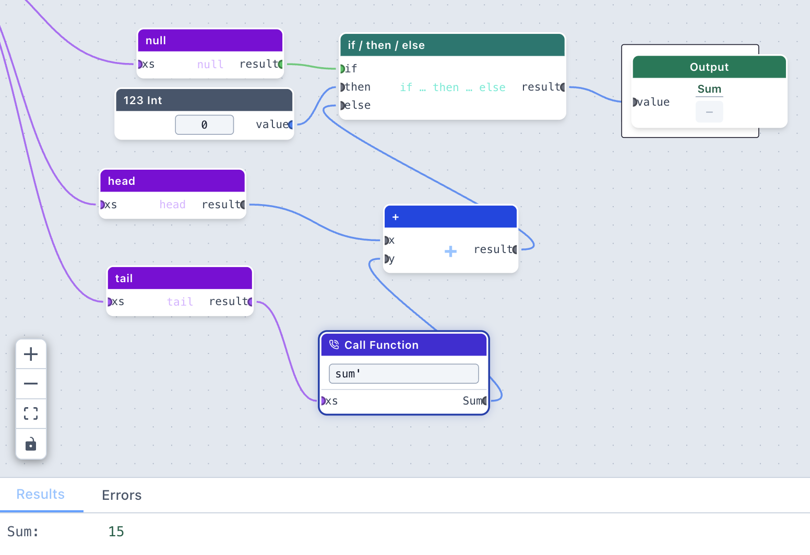

### Testing

**Step 9.** On the outer canvas:
- **Value** `[1,2,3,4,5]` → module **xs**
- module **sum** → **Output**

Click **Run** → `15`

> **Why four anchors?** Every unconnected input port becomes a separate module input when
> wrapping — there is no automatic merging. The `case [ ] of` version (section 8b) avoids
> this because all list work flows through a single node with one `xs` input.


---

## 8b. Alternative — `sum'` using `case [ ] of`

The if-based version above uses `null`/`head`/`tail`. The idiomatic Haskell way is list
**pattern matching**, which the **case [ ] of** node (Control group) supports directly:

```haskell
sum' [] = 0
sum' (x:xs) = x + sum' xs
```

Building a recursive function this way needs **two short passes** inside the module — once
to create it (so the Call node can resolve its ports), then once to finish the wiring.

### Pass 1 — build, wire, and wrap

**Step 1.** Drag five nodes onto the canvas:

| Node | Setting |
|------|---------|
| **case [ ] of** | head variable: `x`, tail variable: `xs'` |
| **Integer** | value: `0` (the base case) |
| **Add (+)** | — |
| **Call Function** | type `sum'` in the name field |
| **Output** | label it `sum` |

**Step 2.** Make these connections:
- Integer `0` → case **[]** (nil input)
- case **head** → Add **a**
- Add **result** → case **x:xs** (cons input)
- case **result** → Output

Leave **case xs** and **Add b** unconnected — both will be wired inside the module.

**Step 3.** Select all five nodes and click **Wrap as function** at the bottom of the canvas.
Name it `sum'`.

The module chip appears with **two input ports** (`xs` and `y`) and one output port.
The `y` port is a placeholder created because **Add b** had no connection yet;
it will be removed in the next step.

### Pass 2 — clean up and complete

**Step 4.** Double-click the module chip to enter its subgraph.

You will see two **anchor nodes** on the left — one labelled `xs` and one labelled `y`.
Select the **`y` anchor** and delete it.

**Step 5.** Click the breadcrumb to navigate **back out**.
The module now has a single `xs` input port, and the Call node inside
automatically picks up its correct ports (one input `xs`, one output `sum`).

**Step 6.** Double-click to re-enter the subgraph.

**Step 7.** Complete the recursive wiring:
- case **tail** (xs') → Call **xs**
- Call **sum** (output) → Add **b**

**Step 8.** Navigate back out.

### Testing

**Step 9.** On the outer canvas:
- **Value** `7` → **range** → module **xs**
- module **sum** → **Output**

Click **Run** → `28`

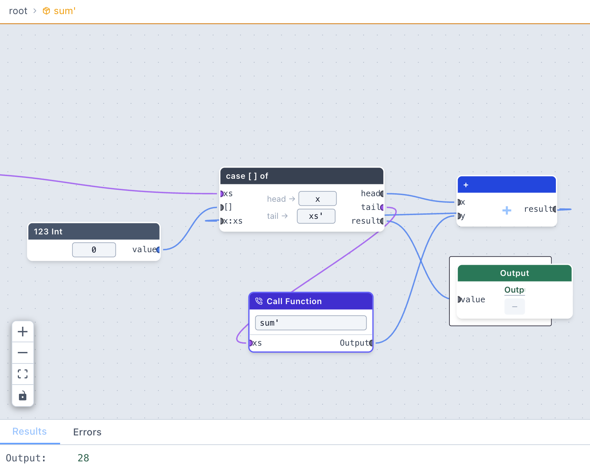

The Haskell panel shows:

```haskell
sum' xs = case xs of { [] -> 0; (x:xs') -> x + sum' xs' }
```

> **Why two passes?** The Call node can only get its output port once the module already
> exists. The first pass creates the module; navigating out triggers an automatic sync that
> gives the Call its output port. The second pass wires that port into Add **b**.

---

## 9. Quicksort

From the worksheet:
```haskell
quicksort [] = []
quicksort (x:xs) =
    quicksort (filter (<= x) xs) ++ [x] ++ quicksort (filter (> x) xs)
```

This is built into Liberator as **Example 12 — Quicksort**. Load it from the Examples menu
to explore the graph.

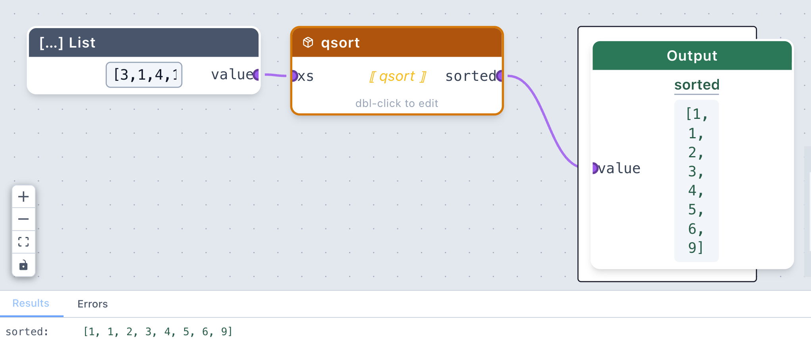

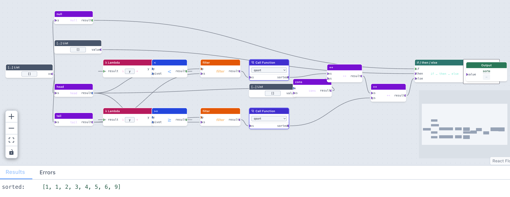

Key things to notice inside the Quicksort module:
- `head` gives the pivot `x`
- `tail` gives the remaining list `xs`
- Two Lambda nodes build the predicates `(\y -> y <= x)` and `(\y -> y > x)`
- Two `filter` nodes partition the list around the pivot
- Two **Call** nodes make the recursive calls
- `++` nodes concatenate the three parts: sorted-left `++ [pivot] ++` sorted-right

---

## 10. Viewing the Haskell

At any point, click the **`</>`** button in the toolbar to open the Haskell panel.
It shows the Haskell source code equivalent to your current graph.

Click **Export .hs** to download it as a `.hs` file you can load into GHCi:

```
ghci MyProgram.hs
```

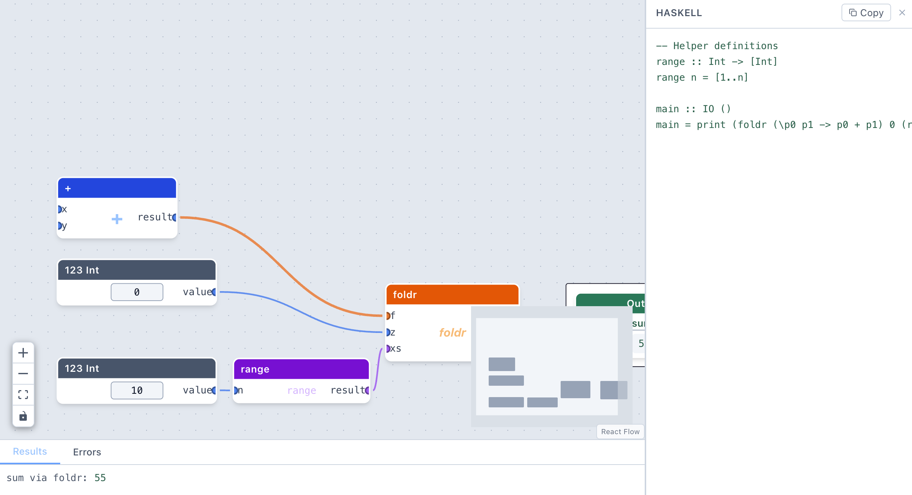

The generated Haskell won't always be idiomatic — it won't use pattern matching or guards —
but it will run correctly.

---

## 11. Saving and loading your work

- **Save** — downloads your graph as a `.json` file
- **Load** — opens a `.json` file you previously saved
- **Export .hs** — downloads the Haskell source

Save regularly! The canvas is not automatically saved between sessions.

---

## What's next?

Once you're comfortable with these basics, explore:

- **Project Euler examples** — the Examples menu includes #1–3 and #5, showing how to compose
  the functions you've learned into real problem-solving

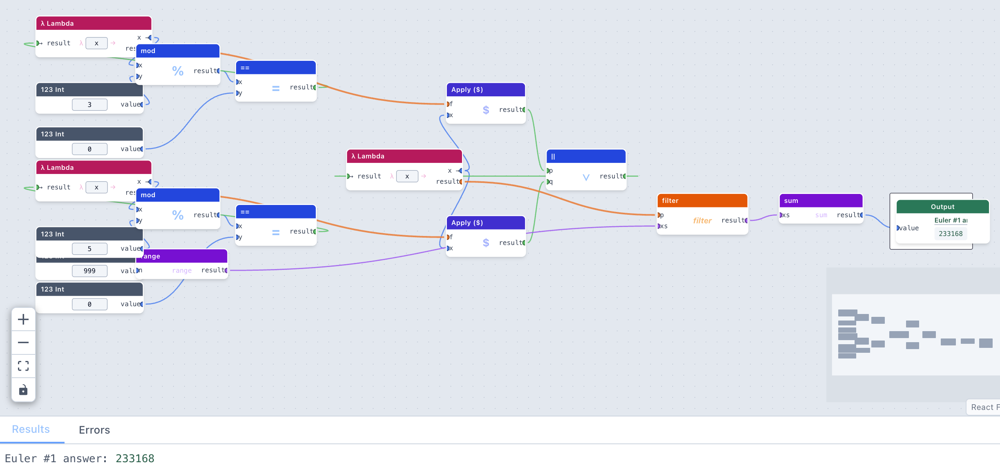

- **The Caesar cipher** — a worked example of `map` over a string using `strToChars` and `charsToStr`

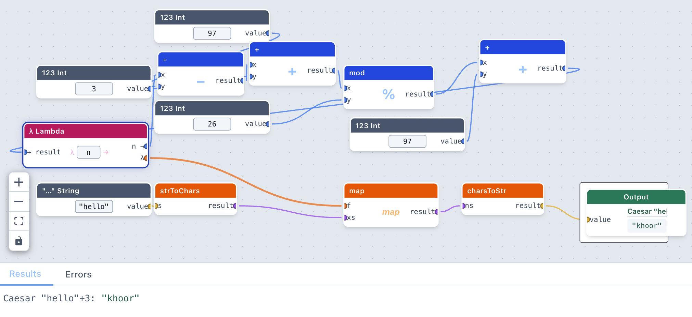

- **Binary search and merge sort** — more complex recursive modules to study and modify

For a full reference of every node type, keyboard shortcut, and toolbar button, see the project [README](../README.md).
